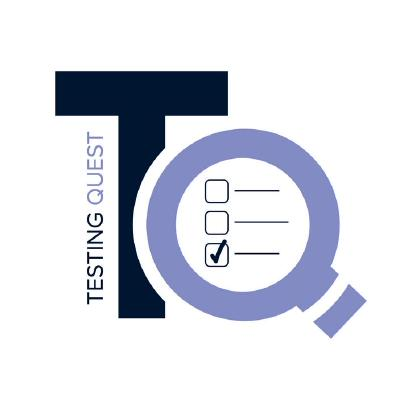

# Testing-Quest Core App

<p align="center">
  
</p>

## Description

Testing-Quest Core App is an open-source web application designed for the analysis and evaluation of tests, exams, and questionnaires. It's part of the larger Testing-Quest project, which offers specialized academic services in test quality auditing and analysis.

## Live Demo

You can access the live version of the Testing-Quest Core App at:
[https://testing-quest.github.io/](https://testing-quest.github.io/)

For more information about the Testing-Quest project, visit:
[https://testing-quest.com/](https://testing-quest.com/)

## Features

- Analysis of test and questionnaire data
- Evaluation of psychometric properties
- Generation of detailed reports
- Support for various question types (dichotomous, multiple-choice, Likert scales)
- Visualization of test results and item performance

## Technology Stack

- React
- TypeScript

## Getting Started

### Prerequisites

- npm (version 10.8.3 or higher)

### Installation

1. Clone the repository:

```bash
git clone https://github.com/testing-quest/core.git
```

2. Navigate to the project directory:
  
```bash
cd core
```

3. Install the dependencies:

```bash
npm install
```

4. Start the development server:

```bash
npm run dev
```

The application should now be running on `http://localhost:3000`.

## Usage

The Testing-Quest Core App provides a comprehensive set of tools for analyzing and evaluating tests, exams, and questionnaires. Here's a brief guide on how to use its core features:

1. Data Input:

- Upload your test data in the required format (CSV or Excel).
- Ensure your data includes item responses, correct answers, and any relevant metadata.

2. Test Analysis:

- Once data is uploaded, the app will automatically calculate key statistics.
- View the overall "Test Health" score and breakdown of potential issues.


3. Item Analysis:

- Examine individual item performance through the Item Table.
- View detailed item statistics and graphs, including:

    - Item characteristic curves
    - Response distribution
    - Distractor analysis (for multiple-choice items)

4. Visualizations:

- Explore various graphs and charts, such as:

  - Item Map (difficulty vs. discrimination)
  - Reliability curve (Spearman-\Brown prophecy)
  - Score distribution histogram


5. Test Refinement:

- Identify problematic items based on statistical indicators.
- Use the "deactivate" feature to temporarily remove items and re-analyze the test.
- Iteratively improve your test by removing or revising underperforming items.


6. Interpretation:

- Use the app's results to make informed decisions about:

  - Item revision or removal
  - Test length optimization
  - Scoring and interpretation guidelines


Remember to consult the [detailed documentation](www.testing-ques.com) for in-depth explanations of statistical concepts and interpretation guidelines. The Testing-Quest Core App automates the analysis procedures described in the accompanying textbook, providing a powerful tool for test development and quality assurance.

## Contributing

We welcome contributions to the Testing-Quest Core App! Please read our [CONTRIBUTING.md](CONTRIBUTING.md) for details on our code of conduct and the process for submitting pull requests.

## License

This code is licensed under the MIT License - see the [LICENSE.md](LICENSE.md) file for details.
